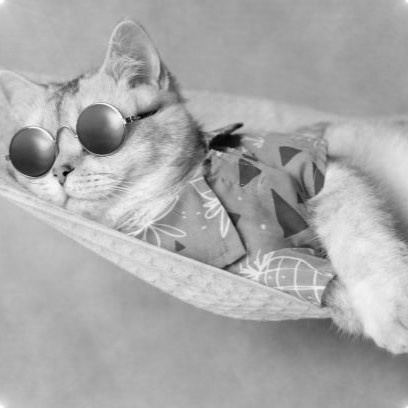

# Image Mixer

In this project, the goal is to design and implement a desktop program that illustrates the significance of magnitude and phase components ,we applied it on images. 

  

## Table of Contents

- [Features](#features)
- [Usage](#usage)

## Features

- **Open 4 Images:** Load Images visualization and processing.

- **Visualize image components:** Visualize the 4 components of each image: Magnitude, Phase, Real, and Imaginary.

- **Real time brightness and contrast control:** Adjust the brightness and contrast 

- **Image Mixer:** Create a new image by mixing either phase and magnitude or imaginary and real in an intuitve way.

- **Regions Mixer:** Mask the regions you want to mix with a single click and drag.

## Usage

1. **Open Images:**

   - Double click the "image port" to select an image for visualization.

2. **Brightness  Control:**

   - Scroll your cursor vertically for brightness control.

3. **Image Mixer:**

   - Choose the mixing mode magnitude/phase or real/imaginary.
   - Use sliders to adjust the components weights percentages.
   - Choose output1 or 2 to show result
   

   
   

4. **Regions Mixer:**

   - Choose the inner or outer mode then use the mouse to select your ROI.

